# ERD — Schema Bazei de Date (BursaTransport)

## Diagrama Relațiilor Entitate

```mermaid
erDiagram

    COMPANY {
        int id PK
        string platform_id
        string name
        string cui UK
        string reg_commerce
        string administrator
        string address
        string city
        string country
        string phone
        string email
        string website
        enum type
        enum anaf_status
        boolean has_transport_license
        boolean has_intermediary_license
        string logo_url
        datetime joined_at
        enum subscription_type
        datetime subscription_expires_at
        decimal crb_balance
        int crb_incidents_remaining
        int crb_reports_remaining
        enum creditreform_risk
        decimal creditreform_credit_limit
        boolean insolvency_declared
        date insolvency_date
        decimal score_as_shipper
        decimal score_as_carrier
        decimal score_as_buyer
        decimal score_as_supplier
        boolean is_active
        boolean secure_login_enabled
    }

    USER {
        int id PK
        int company_id FK
        int location_id FK
        string username UK
        string password_hash
        string email
        string phone
        string skype
        string first_name
        string last_name
        string role_in_company
        string avatar_url
        json languages
        enum user_type
        boolean is_active
        decimal score_personal
        int cargo_posted_count
        int truck_posted_count
        datetime last_login_at
        datetime created_at
    }

    LOCATION {
        int id PK
        int company_id FK
        string name
        string address
        string city
        string county
        string country
        string postal_code
        string phone
        string email
    }

    VEHICLE {
        int id PK
        int company_id FK
        int location_id FK
        string plate_number
        enum type
        decimal capacity_tons
        decimal capacity_m3
        decimal floor_length_m
        boolean has_adr
        boolean has_frigo
        boolean has_walking_floor
        boolean has_lift
        boolean is_mega_trailer
        boolean has_stendere
        int car_transport_slots
        enum container_type
        enum mode
        int year
        string brand
        boolean is_active
    }

    WAREHOUSE {
        int id PK
        int company_id FK
        int location_id FK
        enum type
        decimal surface_m2
        decimal volume_m3
        string address
        string city
        string country
        text notes
    }

    CARGO_LISTING {
        int id PK
        string platform_code UK
        int user_id FK
        int company_id FK
        json loading_locations
        json unloading_locations
        date available_from
        int available_duration_days
        json vehicle_types
        decimal capacity_tons
        decimal capacity_m3
        decimal floor_length_m
        boolean requires_adr
        boolean requires_frigo
        boolean is_groupage
        text cargo_description
        text internal_notes
        decimal price_offered
        enum price_currency
        boolean price_includes_vat
        boolean is_highlighted
        boolean has_auction
        enum type
        enum status
        datetime created_at
        datetime expires_at
    }

    TRUCK_LISTING {
        int id PK
        string platform_code UK
        int user_id FK
        int company_id FK
        int vehicle_id FK
        json departure_location
        json arrival_location
        date available_from
        int available_duration_days
        enum vehicle_type
        decimal capacity_tons
        decimal capacity_m3
        decimal floor_length_m
        boolean has_adr
        boolean has_frigo
        enum mode
        text truck_description
        text internal_notes
        decimal price_per_km
        enum price_currency
        boolean is_highlighted
        boolean sms_notification_enabled
        enum type
        enum status
        datetime created_at
        datetime expires_at
    }

    AUCTION_REQUEST {
        int id PK
        int cargo_listing_id FK
        int user_id FK
        int company_id FK
        decimal price_without_vat
        enum price_currency
        int km_dislocation_included
        int payment_term_days
        datetime loading_at
        datetime unloading_at
        int valid_duration_minutes
        enum status
        datetime created_at
        datetime expires_at
    }

    AUCTION_OFFER {
        int id PK
        int auction_request_id FK
        int user_id FK
        int company_id FK
        decimal price_offered
        enum price_currency
        enum status
        datetime created_at
    }

    PAYMENT_INCIDENT {
        int id PK
        int declarant_company_id FK
        int declarant_user_id FK
        int accused_company_id FK
        decimal invoice_amount
        enum currency
        enum incident_type
        date incident_date
        date due_date
        string payment_instrument
        text description
        json attachments
        enum status
        decimal crb_cost
        datetime created_at
    }

    TRANSPORT_INCIDENT {
        int id PK
        int declarant_company_id FK
        int accused_company_id FK
        enum incident_type
        text description
        json attachments
        enum status
        datetime created_at
    }

    SUBSCRIPTION {
        int id PK
        int company_id FK
        enum type
        datetime starts_at
        datetime expires_at
        decimal crb_included
        int incidents_included
        int reports_included
        int max_users
        decimal price_crb
        decimal price_ron
        boolean auto_renew
        enum payment_method
    }

    CREDIT_TRANSACTION {
        int id PK
        int company_id FK
        int user_id FK
        enum service
        int quantity
        decimal crb_amount
        decimal ron_amount
        datetime created_at
    }

    COMPANY_DOCUMENT {
        int id PK
        int company_id FK
        enum type
        string file_url
        date issued_at
        date expires_at
        datetime uploaded_at
    }

    BLACKLIST_ENTRY {
        int id PK
        int company_id FK
        int blocked_company_id FK
        int blocked_user_id FK
        text reason
        datetime created_at
    }

    FORUM_POST {
        int id PK
        int parent_id FK
        int user_id FK
        int company_id FK
        enum category
        string title
        text body
        int views_count
        int replies_count
        datetime created_at
        datetime updated_at
    }

    CLASSIFIED_AD {
        int id PK
        int user_id FK
        int company_id FK
        enum category
        string title
        text description
        json images
        decimal price
        enum currency
        boolean is_active
        datetime created_at
        datetime expires_at
    }

    NOTIFICATION {
        int id PK
        int user_id FK
        enum type
        string title
        text body
        enum channel
        boolean is_read
        datetime created_at
    }

    SAVED_ROUTE {
        int id PK
        int user_id FK
        string name
        json loading_locations
        json unloading_locations
        enum route_type
        datetime created_at
    }

    PLATFORM_INVOICE {
        int id PK
        int company_id FK
        string invoice_number UK
        string description
        decimal amount_ron
        decimal vat_amount_ron
        date issued_at
        int downloaded_by_user_id FK
        string pdf_url
    }

    EXTERNAL_VERIFICATION {
        int id PK
        int company_id FK
        int user_id FK
        string target_cui
        enum source
        json result_snapshot
        decimal cost_crb
        datetime created_at
    }

    %% ─── RELAȚII ───

    COMPANY ||--o{ USER : "angajează"
    COMPANY ||--o{ LOCATION : "are sedii"
    COMPANY ||--o{ VEHICLE : "deține"
    COMPANY ||--o{ WAREHOUSE : "operează"
    COMPANY ||--o{ COMPANY_DOCUMENT : "uploadează"
    COMPANY ||--o{ SUBSCRIPTION : "activează"
    COMPANY ||--o{ CREDIT_TRANSACTION : "generează"
    COMPANY ||--o{ CARGO_LISTING : "publică"
    COMPANY ||--o{ TRUCK_LISTING : "publică"
    COMPANY ||--o{ AUCTION_REQUEST : "lansează"
    COMPANY ||--o{ BLACKLIST_ENTRY : "blochează"
    COMPANY ||--o{ PLATFORM_INVOICE : "primește"
    COMPANY ||--o{ EXTERNAL_VERIFICATION : "inițiază"
    COMPANY ||--o{ PAYMENT_INCIDENT : "declară (declarant)"
    COMPANY ||--o{ PAYMENT_INCIDENT : "primește (acuzat)"
    COMPANY ||--o{ TRANSPORT_INCIDENT : "declară"

    LOCATION ||--o{ USER : "grupează"
    LOCATION ||--o{ VEHICLE : "alocă"
    LOCATION ||--o{ WAREHOUSE : "asociază"

    USER ||--o{ CARGO_LISTING : "creează"
    USER ||--o{ TRUCK_LISTING : "creează"
    USER ||--o{ AUCTION_REQUEST : "lansează"
    USER ||--o{ AUCTION_OFFER : "depune"
    USER ||--o{ FORUM_POST : "scrie"
    USER ||--o{ CLASSIFIED_AD : "publică"
    USER ||--o{ NOTIFICATION : "primește"
    USER ||--o{ SAVED_ROUTE : "salvează"
    USER ||--o{ CREDIT_TRANSACTION : "efectuează"

    CARGO_LISTING ||--o| AUCTION_REQUEST : "generează"
    AUCTION_REQUEST ||--o{ AUCTION_OFFER : "primește"

    VEHICLE ||--o{ TRUCK_LISTING : "referentiata de"
```



---

## Structura Cheilor și Indexurilor Recomandate

### Indecși principali (performanță căutare)

| Tabel | Index recomandat | Motiv |
|---|---|---|
| `cargo_listing` | `(status, available_from, country_load, country_unload)` | Filtrare principală în search |
| `truck_listing` | `(status, available_from, vehicle_type, capacity_tons)` | Filtrare principală în search |
| `company` | `(cui)`, `(is_active)`, `(subscription_type)` | Căutare + filtrare |
| `user` | `(company_id)`, `(username)` | Login + listare |
| `payment_incident` | `(accused_company_id, status)` | Profil public companie |
| `auction_offer` | `(auction_request_id, status)` | Real-time bidding |
| `credit_transaction` | `(company_id, created_at)` | Rapoarte financiare |

---

## Enums Globale

```
-- COMPANY.type
expeditor | transportator | expeditor_international | ambele

-- VEHICLE.type
duba | prelata | platforma | agabaritic | cisterna |
cap_tractor | basculanta | container | transport_autoturisme | cisterna_alimentara

-- VEHICLE.mode / TRUCK_LISTING.mode
ftl | ltl

-- CARGO_LISTING.status / TRUCK_LISTING.status
activ | expirat | anulat | adjudecat

-- AUCTION_REQUEST.status
activ | expirat | adjudecat | anulat

-- AUCTION_OFFER.status
winning | losing | adjudecat | retras

-- PAYMENT_INCIDENT.status
in_asteptare | rezolvat | contestat | confirmat

-- SUBSCRIPTION.type
flexibil | sprinter_3l | sprinter_6l | caraus_1l |
caraus_3l | caraus_6l | caraus_12l | premium_3l | premium_12l

-- CREDIT_TRANSACTION.service
extra_utilizator | zi_premium | incident_plata | report_companie |
anunt_evidentiat | notificare_sms | consultatie_juridica |
garantare_factura | alimentare_portofoliu

-- EXTERNAL_VERIFICATION.source
anaf | ministerul_finantelor | arr | insolventa |
creditreform_simplu | creditreform_premium

-- NOTIFICATION.channel
in_app | sms | email

-- COMPANY_DOCUMENT.type
cui | licenta_transport | licenta_intermediere |
asigurare_cmr | certificat_adr | alt
```

---

## Rezumat Relații (One-to-Many)

| Tabel Părinte | Tabel Copil | Relație |
|---|---|---|
| `Company` | `User` | 1 companie → N utilizatori |
| `Company` | `Location` | 1 companie → N sedii |
| `Company` | `Vehicle` | 1 companie → N vehicule |
| `Company` | `Warehouse` | 1 companie → N depozite |
| `Company` | `CargoListing` | 1 companie → N mărfuri |
| `Company` | `TruckListing` | 1 companie → N camioane |
| `Company` | `Subscription` | 1 companie → N abonamente (istoric) |
| `Company` | `PaymentIncident` | 1 companie → N incidente declarate |
| `Company` | `PaymentIncident` | 1 companie → N incidente primite |
| `Location` | `User` | 1 locație → N utilizatori |
| `Location` | `Vehicle` | 1 locație → N vehicule |
| `User` | `CargoListing` | 1 user → N anunțuri marfă |
| `User` | `TruckListing` | 1 user → N anunțuri camion |
| `User` | `AuctionOffer` | 1 user → N oferte licitație |
| `CargoListing` | `AuctionRequest` | 1 marfă → 0-1 licitație |
| `AuctionRequest` | `AuctionOffer` | 1 licitație → N oferte |
